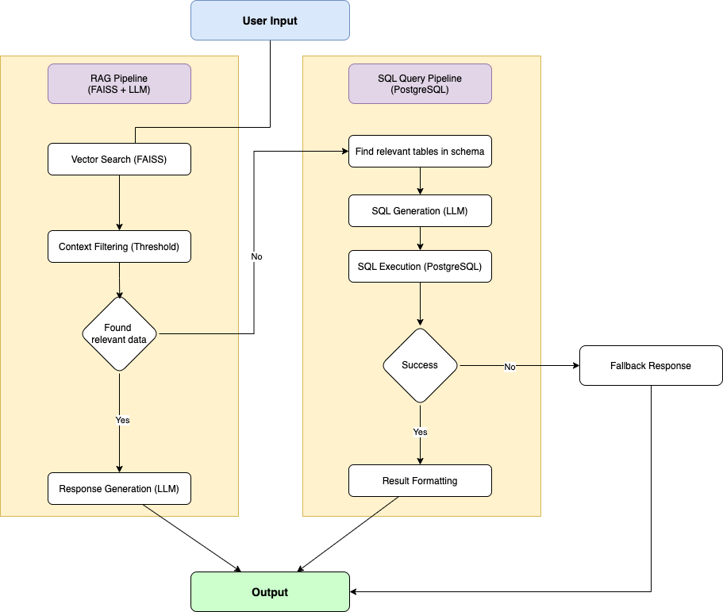

# Tourism LLM Router Project

## Giới thiệu
Dự án này là một hệ thống xử lý và phân tích dữ liệu du lịch sử dụng Large Language Models (LLM) và các công nghệ hiện đại. Hệ thống cho phép tìm kiếm thông tin du lịch thông minh và tạo ra các truy vấn SQL tự động từ ngôn ngữ tự nhiên.

## Kiến trúc hệ thống


## Tính năng chính
- Tìm kiếm ngữ nghĩa (Semantic Search) cho dữ liệu du lịch
- Chuyển đổi ngôn ngữ tự nhiên thành truy vấn SQL
- Xử lý và phân tích dữ liệu du lịch Việt Nam
- Tích hợp với PostgreSQL và pgvector cho lưu trữ vector
- Hỗ trợ tìm kiếm thông minh thông qua FAISS index

## Yêu cầu hệ thống
- Python 3.x
- PostgreSQL với extension pgvector
- Các thư viện Python (xem requirements.txt)

## Cài đặt

1. Clone repository:
```bash
git clone [https://github.com/Ti4nL4/Vietnamese-Travel-Chatbot.git]
cd [Vietnamese-Travel-Chatbot]
```

2. Tạo và kích hoạt môi trường ảo:
```bash
python -m venv myenv
source myenv/bin/activate  # Linux/Mac
# hoặc
myenv\Scripts\activate  # Windows
```

3. Cài đặt các dependencies:
```bash
pip install -r requirements.txt
```

4. Cài đặt pgvector cho PostgreSQL:
```bash
python install_pgvector.py
```

5. Thiết lập cơ sở dữ liệu:
```bash
python setup_database.py
```

## Cấu trúc project
- `data/`: Chứa dữ liệu gốc ban đầu ở định dạng CSV.
- `evaluation/`: Chứa mã nguồn dùng để kiểm thử và bộ dữ liệu kiểm thử.
- `faiss_index/`: Lưu trữ chỉ mục FAISS để truy xuất ngữ nghĩa nhanh chóng.
- `logs/`: Ghi lại log kết quả thực nghiệm như câu hỏi, câu trả lời, và các chỉ số đánh giá.
- `rag_data/`: Chứa dữ liệu phi cấu trúc để dùng cho luồng RAG.
- `sql_output/`: Chứa các file SQL là nội dung từ bộ dữ liệu dưới dạng CSV đã được chuyển đổi sang dạng SQL để thêm vào cơ sở dữ liệu.
- `New_Architecture.png`: Hình ảnh mô tả sơ đồ kiến trúc hệ thống.
- `csv_to_sql.py`: Chuyển đổi dữ liệu từ CSV sang câu lệnh SQL để nạp vào PostgreSQL.
- `install_pgvector.py`: Cài đặt phần mở rộng pgvector cho PostgreSQL để hỗ trợ tìm kiếm vector.
- `my_notebook.ipynb`, `my_notebook.py`: Chứa pipeline xử lý chính, bao gồm định tuyến, truy xuất và sinh phản hồi.
- `pg_query.py`: Thực hiện truy vấn trực tiếp đến cơ sở dữ liệu PostgreSQL.
- `setup_database.py`: Khởi tạo cơ sở dữ liệu, bao gồm tạo bảng và nạp dữ liệu.
- `requirements.txt`: Danh sách thư viện Python cần thiết để cài đặt môi trường.

## Sử dụng
1. Đảm bảo đã cài đặt và cấu hình đúng môi trường
2. Chạy router chính:
```bash
python tourism_llm_router.py
```

## Cấu hình
Tạo file `.env` với các biến môi trường cần thiết:
```
DATABASE_URL=your_database_url
API_KEY=your_api_key
```